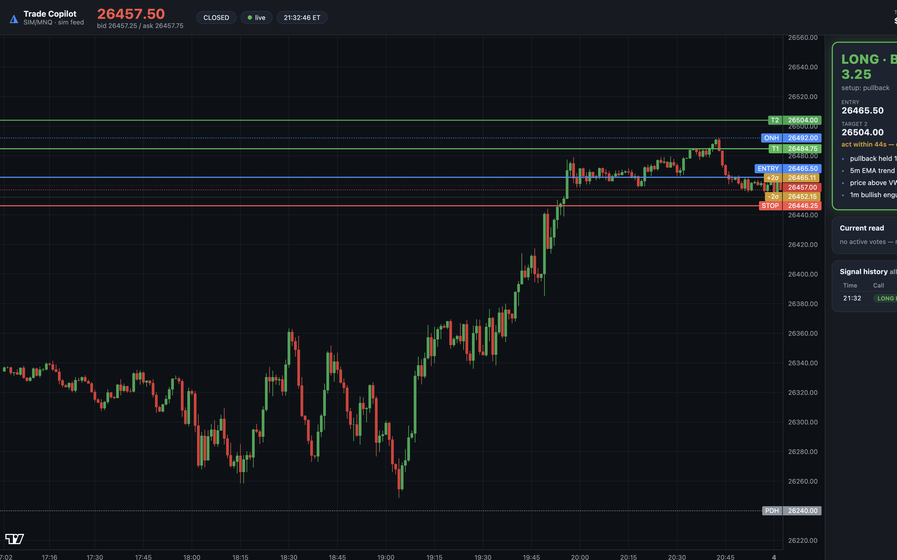

# Trade Copilot — Real-Time MNQ Signal Advisor

A local, advisory-only day-trading copilot for **MNQ (Micro Nasdaq-100
futures)**. It streams real-time CME data through Schwab's free Trader API,
runs a rule-based confluence engine (VWAP, opening range, key levels, EMAs,
volume, patterns), and shows live **LONG / SHORT / STAND ASIDE** calls — with
entry, stop, targets, contract count, and plain-English reasoning — on a
dashboard you keep open next to NinjaTrader Web.

**You** click the buttons in NinjaTrader. This never places trades.



## Quick start

```bash
cd ~/Projects/trade-copilot
.venv/bin/python run.py              # demo mode, simulated feed
.venv/bin/python run.py --feed schwab  # live (see SETUP.md first)
```

Dashboard: **http://127.0.0.1:8000**

New machine? `python3.12 -m venv .venv && .venv/bin/pip install -r requirements.txt`

## How it decides

Every 15 seconds the engine evaluates setup modules that each cast weighted
votes (opening-range breakout, VWAP reclaim/reject and band fades, key-level
reactions, EMA pullbacks, trend continuation, RSI divergence, candlestick
patterns). A call fires only when:

- aligned votes reach the confluence threshold (B-grade ≥ 3.0, A-grade ≥ 4.5),
- a concrete trigger setup is present (bias alone never fires),
- volume confirms breakout-type entries,
- the chop filter, session windows, cooldown, and circuit breaker all allow it.

**Risk per call** — A-grade risks up to $150, B-grade $100. Contracts =
risk budget ÷ (stop distance × $2/pt), capped at 2. Stop too wide → no call.
Two stop-outs in a day → circuit breaker locks the engine until tomorrow.

**Runner logic** — with 2 contracts, half banks at target 1 (1R), the runner
goes for 2R with the stop moved to breakeven.

## The journal keeps you honest

Every signal is tracked against the live tape as if taken: stopped, target
hit, or flat-exit on timeout. The dashboard shows today's and all-time win
rate, P&L, and average R by setup type. **Paper-trust it before you
real-trust it.**

## Backtest / tuning

```bash
.venv/bin/python -m app.backtest.replay --days 10 --seed 7   # synthetic tape
.venv/bin/python -m app.backtest.replay --file data/history/mnq.json
.venv/bin/python -m pytest tests/ -q
```

The replay harness runs the exact live engine over historical 1m bars.
Synthetic tape validates mechanics only — tune weights against real MNQ
data once the Schwab feed has collected some.

## Layout

```
run.py                  entry point
app/config.py           settings (persisted to data/settings.json)
app/feed/               schwab_feed, sim_feed, multi-timeframe bars
app/indicators/         VWAP+bands, EMA, RSI/divergence, ATR, volume, patterns
app/engine/             setups, confluence engine, risk, sessions, chop filter
app/journal/            SQLite journal + outcome tracking
app/server/             FastAPI + WebSocket + dashboard (static/)
app/backtest/           replay harness
scripts/schwab_login.py one-time OAuth
```

## Honest expectations

This is a disciplined second set of eyes that enforces confluence, sizing,
and "don't trade chop" — where most discretionary traders bleed. It is not a
money printer. Validate its stats on paper before sizing up, and remember
$150 risk on a $1,200 account is aggressive; the circuit breaker exists for
a reason.
